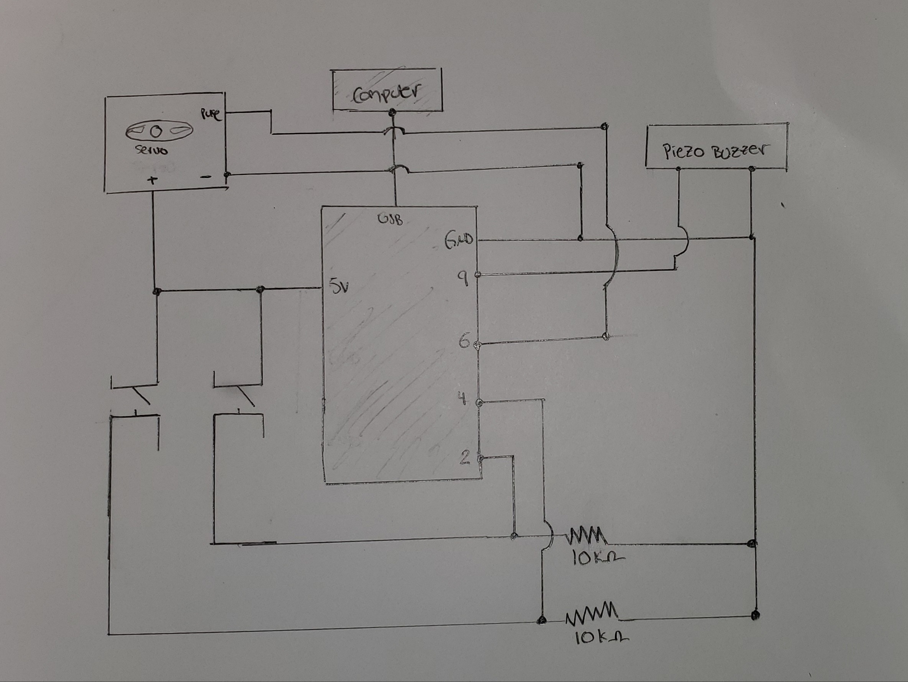

https://drive.google.com/file/d/1htSXNDNQAbFyhT4j6AYatACQvv8XY0IR/view?usp=sharing

Above is a musical instrument, featuring a joyful melody whose playback is provided by a piezo buzzer and is controlled by 
the use of 2 switches. The song's speed is varying, as the interval time between its varying tunes is dictated by a random integer. The melody was inspired by a multitude of previously done examples. A number of tones was created and assembled such that it could conveniently be called through a method. 

The hardest part of its implementation was the fact that tones are non-blocking functions. In other words, after each of these lines are called, the subsequent lines may be ran without interrupting the current lines if they are found to still be running. With this in mind, it was quite tricky getting to stop the tone to play when desired.

The initial approach to this assignment was to first create a simple song that could be played once a button was pressed. I first created the song by assembling a number of tones together, most varying by duration and frequency. Soon after playing them all together, I realized the program ran the tone lines extremely quickly - creating a result far from a melody/song. My following objective was to create a short pause between each tone without using a delay() function. I, therefore, set out to create a timer function I could call after each tone. Once done, I had successfully created a melody, but was still not done with the assignment. My next objective was to make use of a switch in order to play and pause the melody was switched. This was the hardest task of all.

I created a "state" variable which would dictate whether the song was currently playing or not. If it wasn't playing and the switch was activated, the song must play. Likewise, if the song was playing and the switch was pressed, the song must pause. The problem, however, was the fact that I had created the melody, and because this melody was a composition of "tone()" lines one after the other - there was no way for me to stop the entire melody given that each line was a non-blocking function. I spent a long time trying to resolve the issue thinking that the culprit may have been a need for a debounce function call after each switch, but realized that may not be the issue. The button that was initially meant to be a pause/play button resulted in a melody reset button. 

I then decided to add an additional switch to stop the program all together. Within the same program running, I added an additional check which notified my program if this additional switch had been pressed. If so, the "exit" function would be called and the program would terminate - the drawback to this would be the fact that there's no way to implement a restart method. 

Finally, I decided to add a servo taped to a metal ruler that would rotate between positions 160 & 180. These rotations would be triggered after the playback of each tune, making the ruler to strike against a coffee mug and a plastic tape encasing for additional sound after the end of each note.

