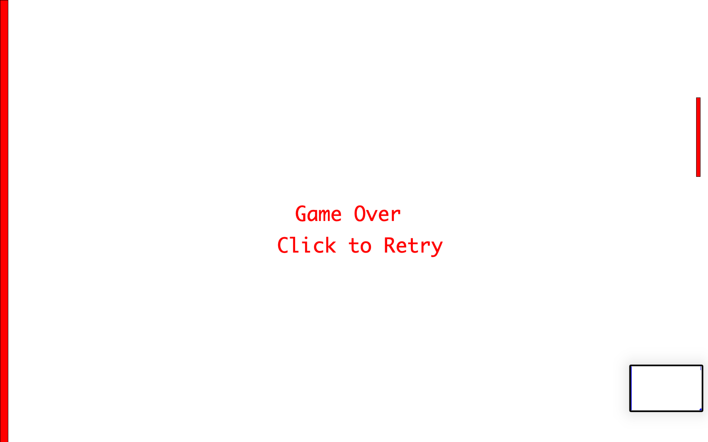

The images above demonstrate a simple game created using transformations, functions, messages, user input. I was inspired to create this game after doing some research on old games I used to play as a child. My initial approach was to create a game where a character crosses from one end of the screen to the other side of the screen while avoiding getting hit my obstacles translating from left to right. Unfortunately, I was unable to complete it because functions relating to pixels and image detection where quite complicated. 

I then remembered this very popular and simple game, Pong!

In class, we had been given hints on how a bouncing ball could be programmed. I just had to figure out how to implement the user controlled bar and the way to control it. 

I believe the most difficult part was figuring out and imagining the boundaries which would deem the ball out of bounce. I eventually figured it out by drawing some sketches on a piece of paper to better understand. Had time permitted, I would have liked to implement more interaction with the user in order to allow more customizability, such as ball diameter, ball speed, bar size, number of tries, difficulty, etc. 
