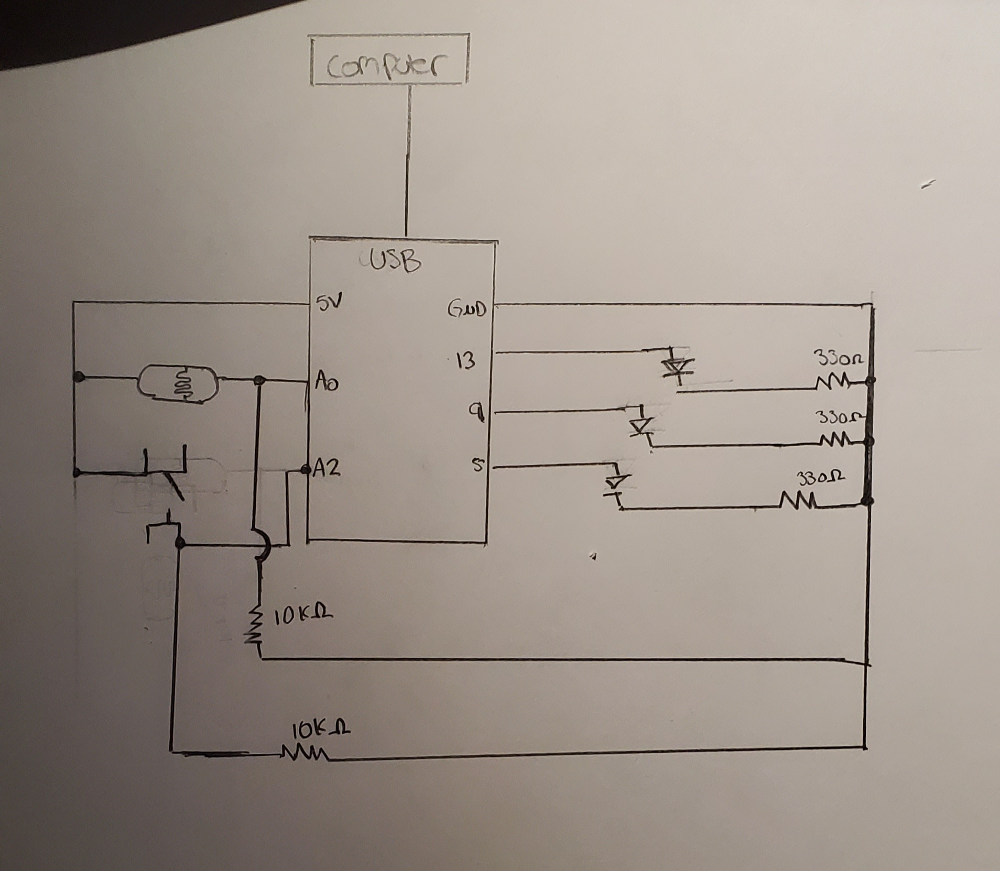

 

https://drive.google.com/file/d/1gL5KrupPA9B9XYADy3IOIbGk2bY1y8Ub/view?usp=sharing

The media above demonstrate my first project using Arduido. I decided that I wanted to challenge myself, so I figured I could make use of 3 LED lights. 
The system functions as follows: 

I press the switch, which receives a digital signal that is then received by the arduino board and read into a corresponding LED pin. In turn, this LED goes from HIGH to LOW which triggers a fading effect on another LED. This fading effect is captured by a photoresistor (analog sensor) and the information is sent to the board. The board then maps this information (150,765) into a smaller range of values between (255,0). The ranges are defined as such because my desk lamp was off and then majority of the light captured by the photoresistor was from the fading LED. As the LED faded, the other LED brightened up and vice versa. After this effect was over, the process would continue after another button press. 

This project was really interesting and allowed me to better understand the collectio of information from analog and digital sensors. My initial intent was to create this project using a no delay approach, but was having some difficulty wrapping my head around the concept. I therefore resorted to using the delay method. I will try my best to incorporate the no delay method in my next project. 

Another difficulty I faced was the approach to wiring the different devices, but after reading the lecture notes and closely analyzing the schematics provided, I was able to figure out what to do :)

