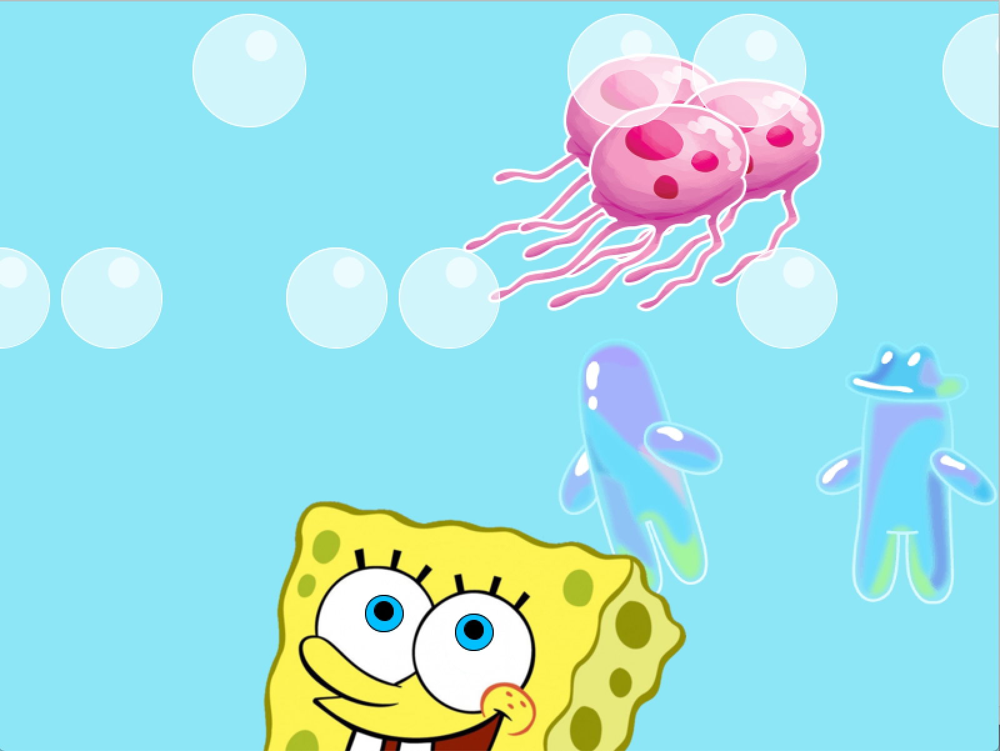

Above is a picture of the outcome of a program where I implemented loops, transformations and functions. The artwork potrays Spongebob happily admiring a group of jellyfish swimming over him as various bubbles ascend while other bubbles float in a rotary motion to his right. 

When creating this artwork, I once again confirmed that the order in which objects are programmed greatly matters. I found myself carefully considering what to program first and also moving pieces of code around the script in order to protray the images I envisioned. As always, syntax is the utmost important rule when programming in addition to commenting. I first had trouble reading my code, but quickly began indexing and adding comments for greater clarity. This helped immensely as I began to add more and more complexity to the artwork.

I first began by loading a spongebob image and animating his eyes. I then thought my project was a little basic, so I decided to implement moving jellyfish that his eyes could track. Once done, I realized the canvas still looked a little empty so I added the rotary bubble figures to his right. Finally, I added a coouple more bubbles for a more lively project. 

One of the hardest difficulties was finding out the initial point of the pupils, their angles of orientation and their pivot/rotation points. To overcome this, I opened a seperate file and began by first experimenting with a circle and applying it basic transformations. Doing this also helped me become more familiar with the way transformation functions worked. Watching Dan Shiffman's tutorials also helped immensely.  Once confident, I added more circles to create eyes and their movement. Finally, I went back to the original file and created the eye animation. By then, I was familiar witht the basics of the homework, which simplified the rest of the work.

The most interesting thing about this project was being able to load, edit, transform and animate images! The links to the images used for the project are below:

1. https://i.pinimg.com/originals/69/68/65/696865b0736fe48a7f9628d74fb0b46f.png
2. https://vignette.wikia.nocookie.net/nickelodeon/images/a/a5/Jellyfish_in_2018.png/
3. https://cdn.custom-cursor.com/packs/1820/pack2447.png

Inspiration: 

I'm not too sure how I came up with this idea, but I believe my inspiration was an accumulation of tutorials. I first watched one of Dan Shiffman's videos where he showed a quick animation of a ball ascending to the canvas' ceiling. Then out of curiosity, I looked up how to load images in Processing and came across the following link:

https://processing.org/reference/PImage_resize_.html

In the tutorial, there is an image portrying a jellyfish. The image is being loaded and resized.

Next thing I knew, I had spongebob  in my mind!
