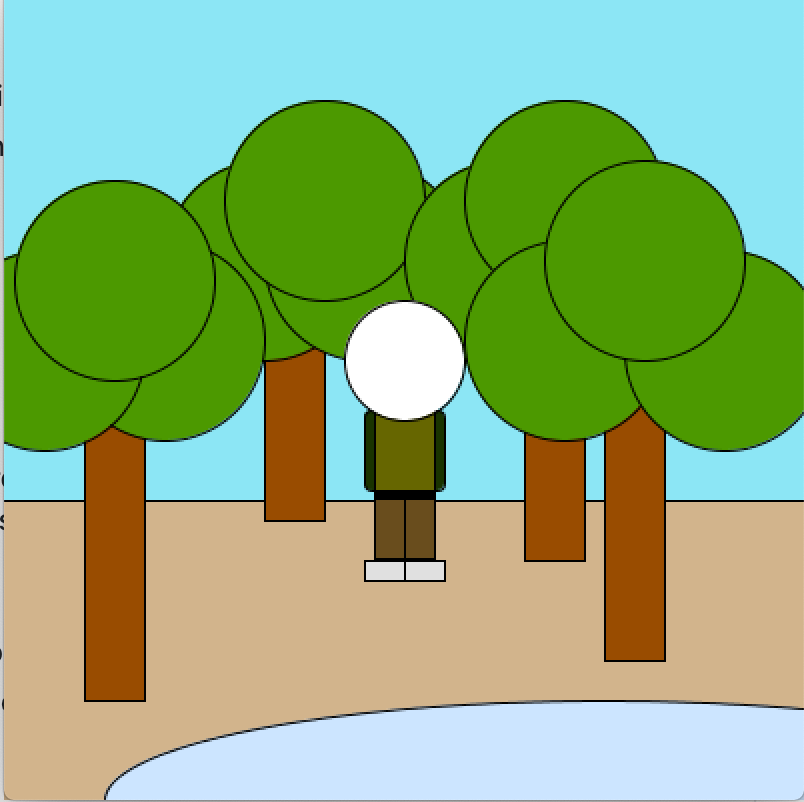

Below is a picture of my *self portrait*

The picture portrays me standing in front of a river in the middle of a forest. This environment is important to me because I value nature and the tranquility it brings. Nature in general allows me to detach from the modern world and appreciate the beauty of life.

When creating this portrait, the main trouble I faced was a constant trial and error process of estimating the appropriate size for shapes. Another problem was the visualization and placing of objects given the way the coordinate system is set up. After some time, however, I managed to get the hang of it. The last problem faced was the overlapping of certain objects. For instance, at some points, the trees were blocking the person in the portrait. i quickly realized order matters in order to have certain objects placed in their appropriate location. 

I really enjoyed this activity!
