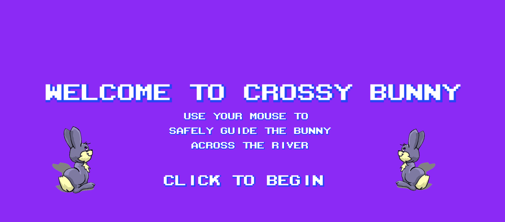
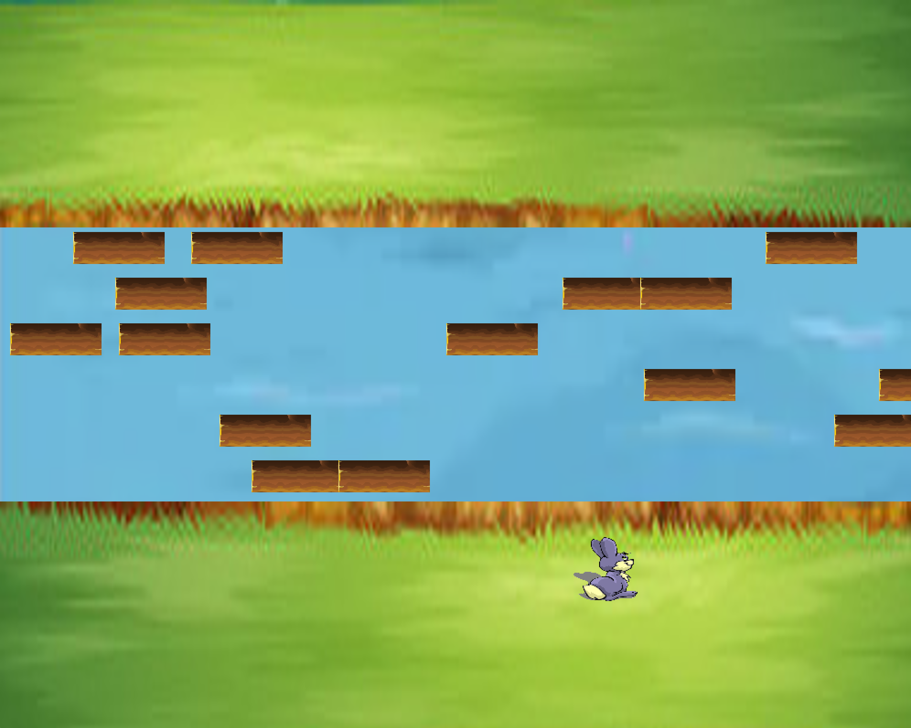
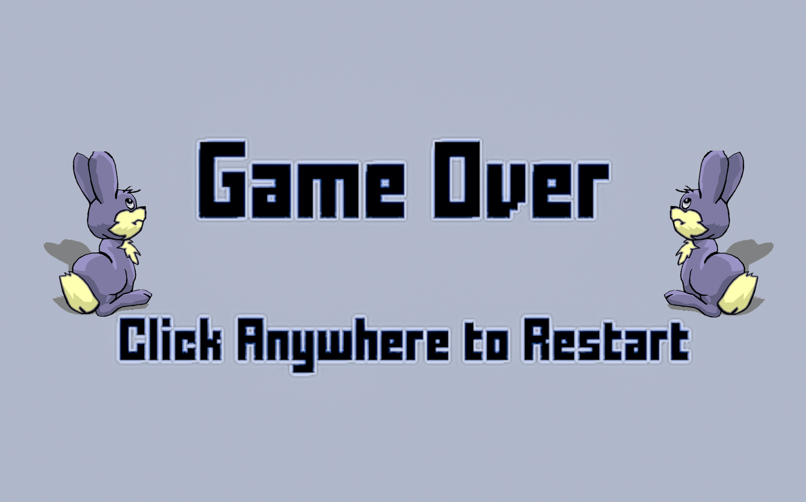
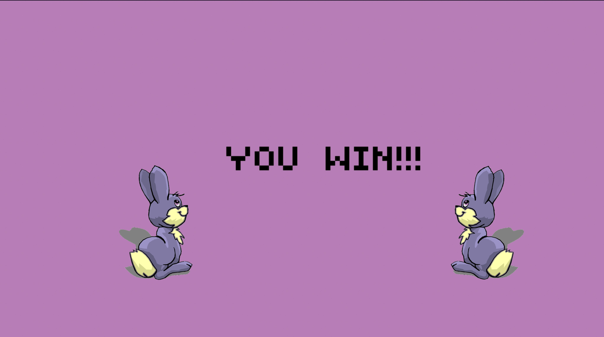

This project features an arcade-like game where the obective is to 
safely guide a stranded bunny across a river using the user's mouse.

The inspiration to write this game came after reminiscing of my childhood games. When I was a child, I remember visiting my local
computer store to play games during the weekends. One of the games I had most fun was the one implemented, where a racoon had to cross a street in order 
to proceed to the next levels. 

Though the game is quite simplistic, it's implementation required a great load of creativity throughout the course of a week.

The most challenging tasks consisted of: 

1) Creating multiple logs at once, with different positions, and speeds.
2) Finding a way to display a start screen, a game screen, a victory screen, and a game over screen in the program.
3) Determining whether the bunny is found within the river region.
4) Implementing a program fast enough that would not slow down the overall quality and runtime of the game.
5) Determining whether the bunny was standing on a log or on the river - particularly difficult with multiple moving logs.

Approach to each problem: 

