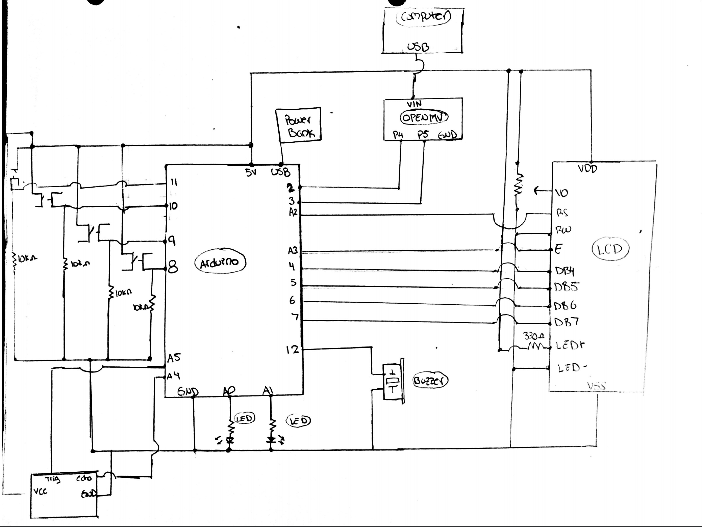

**Locked State**

**Presence Detected State**

**Passcode Combination State**

**Alarm Triggered State**

**Unlocked State**

**Description:**

My project consists of a security system capable of detecting human presence. In order to obtain access past an entrance, the human detected will be prompted to enter an appropriate passcode. The system will respond accordingly and dictate if access is granted.

**Process:**

The project is powered by 2 microcontrollers, Arduino uno and an OpenMV H7, which work together over a software UART connection along with an ultrasonic sensor. Together, these devices are capable of detecting human presence and in turn, respond to the behavior of the person detected. When no human is detected, the system remains in a "Locked State", actively scanning for humans to be detected. Once a human is scanned, the system automatically enters the state of awareness known as the "Presence State", indicating through an LCD Display that a human was detected. If the person closes proximity, the system will respond by prompting the individual to enter a 3 color-passcode combination. The individual will then have a total of 3 attempts to enter the appropriate passcode. If the passcode is found to be correct, the system will enter its "Unlocked State" indicated through the LCD display and a combination of a tone created by a piezo buzzer along with a flashing green LED. However, if the passcode is entered incorrectly, the system will enter its "Alarm Triggered State" followed by a loud alarm and a distinctive sequence of red LED flashes. The system will also display on the computer screen the image of the last person dectected.

An additional reset button was implemented within the project, which would be placed away from the entry in a real life scenario. This button resets the connection between both microcontrollers and re-initiates the system for its next use.

Difficulties: 

*States*
Given the how logic heavy this project is based, I found it a fun challenge deciphering how many different stages the system should have and the variables each state should depend on. I therefore found it easier to first solve the issue with the UART communication interface between both microcontrollers. From the data collected, I would then decide the following steps to take. For instance, my first stage was a detection stage. At all times, the OpenMV webcam would be looking for humans and communicate with the arduino. Thus, I needed to find a way to store the information exchange between both devices and know when a person was detected.

*Conditions for Presence*
The OpenMV camera is equipped with many features, and the 2 most relevant/applicable were those of human detection and facial recognition. After careful consideration, I confirmed that the best feature for my project would be that of human detection. This had a great tolerance for when a person was detected and did not require the individual to be 2 feet away from the camera in order to be detected as it was with the facial recognition feature. This is quite applicable in real life scenerios, where a security system would serve best if a person was detected even if at a large distance away. 

The second issue was to be able to determine when to prompt the individual to enter a passkey. It would not make sense for the Camera to detect a person 20+ feet away and ask them to enter a passcode, given that they are not an immediate risk. Though the camera was connected to my computer, I did not know how to scan or manipulate the pixels of the camera's field of view to determine or estimate the distance between the person and an entrance. I therefore decided to implement an ultrasonic sensor that would be used to trigger 2 different states. If the camera found a person but was detected by the ultrasonic sensor to be far enough to not pose a "security risk", then the system would be in "human presence detected mode." However, if the camera continued to detect the individual and the ultrasonic sensor noticed that the individual was much closer, then the individual would be prompted to enter the appropriate passcode to continue. 

*UART Connection*
One of the biggest initial challenges was establishing connection between the Arduino Uno and the OpenMV Camera. I had the option of communication between I2C, Software UART, SPI, USB VCP, or WiFi. The only process I was familiar with was that of UART between Processing and Arduino. This time was different and I was not sure how software and hardware differed. I decided to reach out to OpenMV and was able to get in contact with their co-founder, who gladly helped me throughout the process of debugging and establishing a connection between both devices. 

*Button Functionality*
Making sure to collect the precise button-press input from the user was of utmost importance. As a result, I had to become acquainted with button debouncing. Unfortunately, debouncing a button press was not sufficient enough because when a button was pressed, my program did not know whether it was pressed once or many times - this could have significantly altered the data collected for the user's button combination. I found Edge detection to be the solution for this issue, as it allowed me to count the amount of times a button was pressed and thus create an appropriate structure to accurately store button information. 

I then came across the issue of having to create multiple instances of buttons. My thought was to create a Button class, but the issue was that I had never programmed in C++ and much less created a "class." After a long process of learning about Arduino libraries, header files, source files, public and private variables, and much more i was able to define an appropriate logic and method sequence for the aspect of button functionality in my project. 

The last issue I often faced during my project was the large interruptions of communications between pins. If Serial communication was active, an LED light was shining, the ultrasonic sensor was scanning distance, or data was being transferred between devices, the entire program would sometimes miss messages or signals until the other tasks were complete. It was thus a cumbersome task implementing a program that minimized these interruptions. 

**Schematic and Close Ups**

