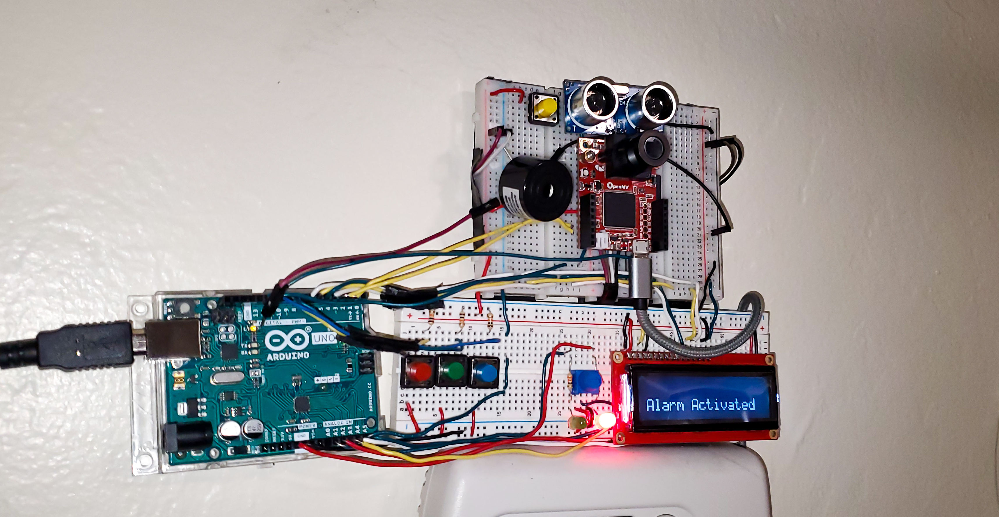

**Locked State**

**Presence Detected State**

**Passcode Combination State**

**Alarm Triggered State**

**Unlocked State**

Description:

My project consists of a security system powered by 2 microcontrollers, Arduino uno and an OpenMV H7, which work together over a software UART connection along with an ultrasonic sensor. Together, these devices are capable of detecting human presence and in turn, respond to the behavior of the person detected. When no human is detected, the  system remains in a "Locked State", actively scanning for humans to be detected. Once a human is scanned, the system automatically enters the state of awareness known as the "Presence State", indicating through an LCD Display that a human was detected. If the person closes proximity, the system will respond by prompting the individual to enter a 3 color-passcode combination. The individual will then have a total of 3 attempts to enter the appropriate passcode. If the passcode is found to be correct, the system will enter its "Unlocked State" indicated through the LCD display and a combination of a tone created by a piezo buzzer along with a flashing green LED. However, if the passcode is entered incorrectly, the system will enter its "Alarm Triggered State" followed by a loud alarm and a distinctive sequence of red LED flashes. The system will also display on the computer screen the image of the last person dectected.

